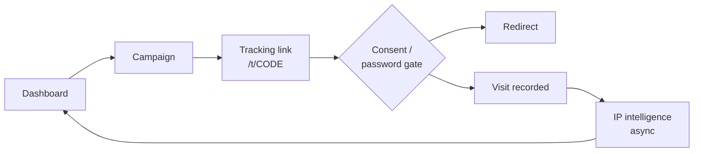
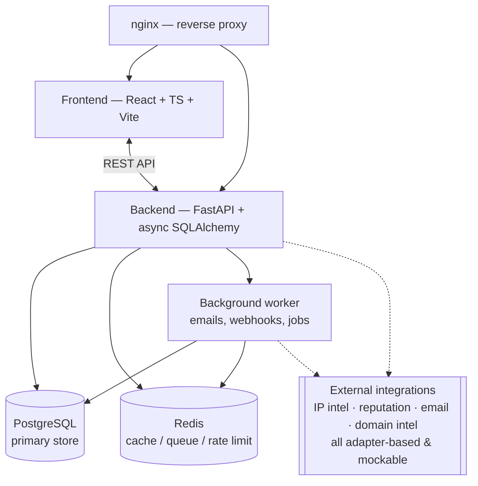

# Aventrix

**A URL intelligence & campaign management platform**, done responsibly: create tracked links, organize them into campaigns, generate QR codes, run domain/security reconnaissance, and see privacy-respecting analytics about who's clicking — with explicit visitor consent built into the core flow, not bolted on afterwards.

Built as a full production-shaped SaaS: FastAPI + async SQLAlchemy backend, React + TypeScript frontend, Postgres, Redis, a background worker, and an optional companion Android app for remote device control — all containerized behind nginx.


---

## Table of contents

- [Highlights](#highlights)
- [Feature tour](#feature-tour)
- [Architecture](#architecture)
- [Project structure](#project-structure)
- [Tech stack](#tech-stack)
- [Quick start](#quick-start)
- [Documentation](#documentation)
- [Security & privacy](#security--privacy)
- [Testing](#testing)
- [Roadmap](#roadmap-not-yet-built)
- [License](#license)

---

## Highlights

- 🔗 **Smart links** — custom aliases, expiration, password protection, optional consent gate, reserved-word/collision checks, UTM builder
- 📊 **Privacy-respecting analytics** — visit trends, top countries/devices/browsers/OS/referrers, date-range filters, CSV/JSON export
- 🧭 **Recon & OSINT toolkit** — subdomain enumeration, DNS propagation checks, technology detection, robots.txt/sitemap parsing, cookie analysis, WHOIS, SSL inspection
- 🛡️ **Security Center** — DNS/WHOIS/SSL checks, security-headers analyzer, reputation scoring, combined into a 0–100 score with history
- 📱 **QR codes** — server-generated PNG/SVG, customizable size/colors/error-correction, optional embedded logo
- 🧰 **URL tools** — encoder/decoder, UTM builder, SSRF-hardened URL analyzer, redirect-chain checker
- 🔑 **Tiered API keys** — Free/Pro/Business, hashed at rest, per-tier rate limits
- 🪝 **Webhooks** — HMAC-signed, event-driven, async delivery with retry backoff and a delivery log
- 🔔 **Notifications** — in-app + email, triggered by first visits, expirations, webhook failures, low security scores
- 🔐 **Serious auth** — refresh-token rotation, email verification, password reset, 2FA (TOTP + backup codes), session management, RBAC (`SUPER_ADMIN → ADMIN → MANAGER → USER → VIEWER`) enforced server-side
- 📲 **Devices module** — AirDroid-style remote screen control via a companion Android client

## Feature tour

### Links & campaigns
Create tracked links with custom aliases, expiration dates, password protection, and an optional visitor consent gate. Group links into campaigns and drill into per-campaign performance: total clicks, unique visitors, CTR, top country/device/browser, and a visit timeline. The redirect system never trusts request input for its target — the destination is only ever read back from the database, closing off the usual open-redirect surface.

### Analytics
A filterable, exportable analytics page: stat cards, visit trends over time, and breakdowns by country, device, browser, OS, and referrer. Every visit records IP intelligence (mock provider by default, real-provider adapter ready to wire in) and UA-derived signals, including a bot-confidence score. The raw client IP is recorded on every visit; the richer device/browser/UTM fingerprint is only captured when the visitor has explicitly consented (see [`docs/SECURITY.md`](./docs/SECURITY.md#privacy)).

### Security Center & recon/OSINT
Analyze any domain you own or are authorized to test:

- DNS records, DNS propagation across resolvers, WHOIS, SSL certificate details
- Subdomain enumeration and technology/stack detection
- `robots.txt` / sitemap parsing
- Cookie analysis (flags, scope, security attributes)
- Security-headers analyzer (CSP, HSTS, X-Frame-Options, etc.) and a reputation check (mock by default, real adapter ready)

All findings roll up into a single 0–100 security score with full scan history.

### QR codes & URL tools
Generate a QR code (PNG/SVG) for any link with configurable size, colors, error-correction level, and an optional embedded logo. The URL tools page adds an encoder/decoder, a UTM builder, an SSRF-hardened URL analyzer (title/description/favicon preview), and a redirect-chain checker.

### API, webhooks & notifications
Issue tiered API keys (Free/Pro/Business) as an alternate credential for the whole API — shown once, hashed at rest, rate-limited per tier. Subscribe to webhooks (`link.created/clicked`, `campaign.created/completed`, `security.alert`) delivered with HMAC signatures, async retry backoff, and a delivery log. The in-app + email notification center covers a link's first visit, link expiry, webhook failures, and low security scores, with per-type email preferences.

### Devices (remote control)
A companion Android client (`android/`) pairs with the platform to enable AirDroid-style remote screen viewing/control, built alongside its own signaling protocol (see [`docs/DEVICE_CONTROL_PROTOCOL.md`](./docs/DEVICE_CONTROL_PROTOCOL.md)).

### Security baseline (platform-wide)
Rate limiting, security headers, CORS, a standard error envelope, structured JSON logs, an audit log, IDOR-safe ownership checks throughout, and SSRF-hardened outbound fetching everywhere a user-supplied URL is fetched server-side.

## Architecture



Backend modules under `backend/app/`:

```text
app/
├── api/v1/          REST endpoints (auth, campaigns, links, analytics, tracking,
│                    qr, url_tools, security_center, api_keys, webhooks,
│                    notifications, devices, dashboard)
├── core/            config, DB session, settings
├── models/          SQLAlchemy models
├── schemas/         Pydantic request/response schemas
├── services/        business logic (one service per domain)
├── repositories/    data-access layer
├── middleware/      rate limiting, security headers, error envelope
├── security/        auth, RBAC, hashing, tokens
├── analytics/       aggregation logic
├── integrations/    provider adapters — ip_intelligence/, reputation/, email/, domain_intel/
├── workers/         background job handlers
└── utils/
```

## Project structure

```text
Aventrix/
├── android/       companion Android client (device control)
├── backend/       FastAPI application + Alembic migrations + tests
├── frontend/      React + TypeScript + Vite SPA
├── worker/        background worker Dockerfile/entrypoint
├── nginx/         reverse proxy config (dev + production)
├── docker/        supporting Docker assets
├── scripts/       dev-setup helpers, DB backup, Let's Encrypt init
├── docs/          SETUP, ARCHITECTURE, DATABASE, API, SECURITY,
│                  ENVIRONMENT, DEPLOYMENT, DEPLOY_VPS, CONTRIBUTING,
│                  DEVICE_CONTROL_PROTOCOL
├── docker-compose.yml       development stack
├── docker-compose.prod.yml  production stack
├── LICENSE
└── .env.example   every configurable environment variable
```

## Tech stack

**Frontend** — React 18 · TypeScript · Vite · Tailwind CSS · Radix primitives · TanStack Query · React Router

**Backend** — Python · FastAPI · Pydantic · SQLAlchemy (async) · Alembic

**Data** — PostgreSQL · Redis (cache, rate limiting, queue)

**Infra** — Docker Compose · nginx · a dedicated background worker service

**Mobile** — Kotlin / Android (companion device-control client)

## Quick start

**With Docker (recommended):**

```bash
cp .env.example .env      # edit secrets/URLs as needed
docker compose up
```

Or run `scripts/dev-setup.ps1` (Windows) / `scripts/dev-setup.sh` (macOS/Linux) — it creates `.env` for you and checks whether Docker is on your PATH.

This brings up Postgres, Redis, the API, the background worker, the frontend dev server, and nginx. Migrations and a development admin seed run automatically on backend startup — watch the logs for a one-time printed admin password.

| Service | URL |
| --- | --- |
| App (via nginx) | http://localhost:8080 |
| Frontend directly | http://localhost:5173 |
| API docs (Swagger) | http://localhost:8000/api/docs |

**Without Docker:** see [`docs/SETUP.md`](./docs/SETUP.md) for running the backend and frontend locally against your own Postgres/Redis.

**Android client:** see [`android/README.md`](./android/README.md) to build the companion app (`./gradlew assembleDebug`).

## Documentation

| Doc | Purpose |
| --- | --- |
| [SETUP.md](./docs/SETUP.md) | Docker and manual local setup |
| [ARCHITECTURE.md](./docs/ARCHITECTURE.md) | System design, module layout, what's built vs. deferred |
| [DATABASE.md](./docs/DATABASE.md) | Schema, indexes, retention |
| [API.md](./docs/API.md) | Endpoint reference |
| [SECURITY.md](./docs/SECURITY.md) | Threat model, protections, known advisories |
| [ENVIRONMENT.md](./docs/ENVIRONMENT.md) | Every environment variable explained |
| [DEPLOYMENT.md](./docs/DEPLOYMENT.md) | Production deployment notes and checklist |
| [DEPLOY_VPS.md](./docs/DEPLOY_VPS.md) | Step-by-step VPS deployment |
| [DEVICE_CONTROL_PROTOCOL.md](./docs/DEVICE_CONTROL_PROTOCOL.md) | Remote device-control signaling protocol |
| [CONTRIBUTING.md](./docs/CONTRIBUTING.md) | Code style, testing, PR expectations |

## Security & privacy

This platform is built around a strict rule: **no covert data collection.** Every feature that touches a visitor's device or data goes through explicit consent, never a silent default. Concretely:

- Visitor consent is a first-class UI step before any device/browser/UTM fingerprint is captured
- All external integrations (IP intelligence, reputation, email, domain intel) are adapter-based, configured via environment variables, and degrade gracefully with a mock provider when no key is configured — the app never crashes because a third-party key is missing
- Outbound fetches of user-supplied URLs (link previews, domain analysis, redirect checks) are SSRF-hardened: private IP ranges, localhost, internal networks, and cloud metadata endpoints are all blocked, with timeouts, response-size limits, and redirect limits enforced
- Authorization is checked server-side on every request (RBAC), not just hidden in the UI — no IDOR by ID-guessing
- Passwords, JWT secrets, and API keys are never hard-coded; secrets live only in `.env` (see `.env.example`)

Full threat model and known advisories live in [`docs/SECURITY.md`](./docs/SECURITY.md).

> **Responsible use only.** The recon/OSINT and Security Center tooling (subdomain enumeration, DNS/WHOIS/SSL checks, header/reputation analysis) is intended for domains and assets you own or are explicitly authorized to test.

## Testing

```bash
# Backend
cd backend && pytest

# Frontend
cd frontend && npm test
```

Tests are written alongside features, not bolted on afterward — unit coverage for auth, link generation, validation, analytics, and the IP service; integration coverage for the database, API, auth flow, and redirect system; dedicated security tests for IDOR, SSRF, and rate limiting; component/form/navigation tests on the frontend.

## Roadmap (not yet built)

PDF report export · real-time SSE/WebSocket live-visitor dashboard · AI campaign/analytics assistant · full admin panel · multi-user workspaces · billing/subscriptions · CI/CD pipeline.

See [`docs/ARCHITECTURE.md`](./docs/ARCHITECTURE.md) for the complete built-vs-deferred breakdown.

## License

Released under the [MIT License](./LICENSE) — see the file for the full text.
